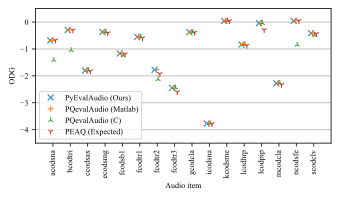

# PyEvalAudio

## Installation

To install, just use
```
pip install git+https://github.com/peladeaucome/PyEvalAudio.git#subdirectory=Installation
```

## Porting PQevalAudio to Python

This is a port of the PQevalAudio Matlab code to Python.

## How to use
To use, import ```peaq_numpy``` and create a ```peaq_numpy.PEAQ()``` instance.
This object then has ```compute_peaq``` and ```compute_2fmodel``` methods to compute either the PEAQ score (ODG) or the 2fmodel.

An example of use can be found in the ``testparse.py`` script.

**The audio should be sampled at 48 kHz**

```Python
from PyEvalAudio import PEAQ

peaq = PEAQ(
    mode = "basic", #PEAQ computation mode. Only the basic mode is implemented.
    Amax = 1, # Maximum value of the audio waveform (0dBFs). Should usually be set to 1, except if the audio is in int type
    verbose = False,
    output = "odg" # whether you want the model to output the ODG, the DI or both
)

# This is the method used to compute the ODG and DI
ODG = peaq.compute_PEAQ(x_T=tested_audio, x_R=reference_audio)

# This is the method used to compute the 2f-model
twof = peaq.compute_2fmodel_from_waveform(x_T=tested_audio, x_R=reference_audio)
```


## Accuracy

We tested the accuracy of our computation of our implementation by comparing it on the official PEAQ test examples.
We also compared our 2f model implementation to the one found [here](https://www.audiolabs-erlangen.de/resources/2019-WASPAA-SEBASS/).

We find that both are very close to the originals.

### PEAQ ODG

We tried to reproduce the PQevalAudio code as well as we could.
We show in the following figure how well we translated the code on the official testing examples.
The PQevalAudio labels show the results of the 2 implementations (one in Matlab, one in C) of the official implementations of PQevalAudio (Kabal, 2003).
The PEAQ label shows the expected results on the conformance items written in the PEAQ standard (ITU-R, BS.1387-2, page 71).



Our implementation matches closely the PQevalAudio implementation.
On this dataset, the RMSE between the ODG computed using ours and the PQevalAudio Matlab code is $3.46\times10^{-3}$ (the range is between 0 and -4).
This was tested on the PEAQ conformance audio examples.

### 2f-model

As for the 2f-model, we compare our code with the values given with [its adaptation to the PQevalAudio implementation](https://www.audiolabs-erlangen.de/resources/2019-WASPAA-SEBASS/).

Across the given dataset, the RMSE between the expected values and ours is $8.61\times10^{-2}$.
The maximum absolute error on this dataset is of $0.712$.
The MMS is between 0 and 100.

# Cite this work:

This work was released with a scientific article.
If you use it in research, please cite it as:

```LaTeX
@misc{peladeauEstimatingDistributionsDDSP2026,
  title = {Estimating Distributions in {{DDSP}} Systems: Applications to {{FM}} Synthesis and Audio Effects Estimation},
  author = {Peladeau, Côme and Fourer, Dominique and Peeters, Geoffroy},
  date = {2026-01},
  note = {Submitted to IEEE TASLP}
}
```

This work is a Python implementation of the following:
 - P. Kabal. An Examination and Interpretation of ITU-r BS.1387: Perceptual Evaluation of Audio Quality. Tech. rep. McGill University,
2003.
 - Thorsten Kastner and Jürgen Herre. “An Efficient Model for Estimating
Subjective Quality of Separated Audio Source Signals”. In: Proc. of IEEE WASPAA. 2019, pp. 95–99
 - Thorsten Kastner and Jürgen Herre. AudioLabs - Subjective
Evaluation of Blind Audio Source Separation Database SEBASS-DB.
https://www.audiolabs-erlangen.de/resources/2019-WASPAA-SEBASS/.